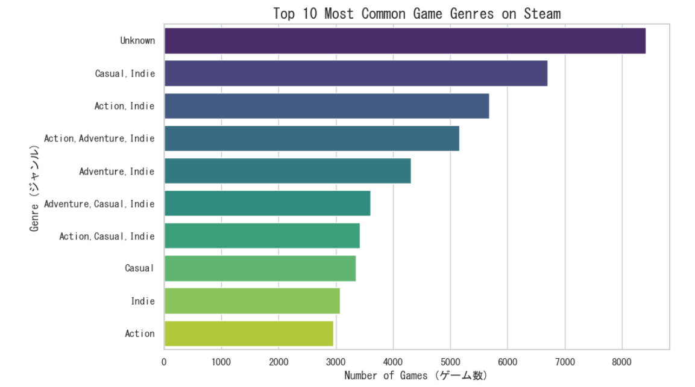
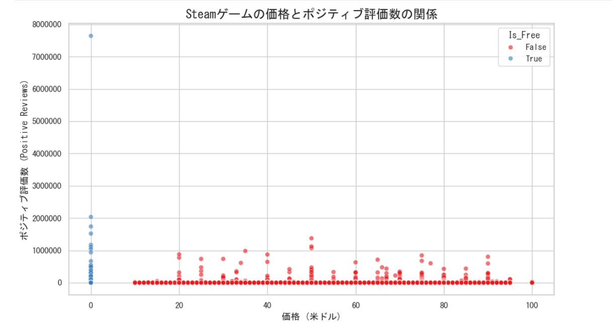

# Steam Games Data Analysis (Python Complete Challenge)
This repository showcases an end-to-end data analysis project focused on Steam games. The entire pipeline—from data loading and extensive cleaning to advanced visualization—was built strictly using Python (Pandas, Matplotlib, and Seaborn) without relying on external BI tools like Tableau or Excel.

## 📊 Visualizations & Insights

### 1. Top 10 Game Genres on Steam

* **Market Saturation:** Excluding the 'Unknown' values (missing data handled during preprocessing), the market is heavily dominated by combined tags like **Casual, Indie**, and **Action**. 
* **Strategic Takeaway:** The competition in these standard genres is extremely fierce. Developers aiming to stand out must look into more niche sub-genres or distinct cross-genre innovations rather than generic action-casual labels.

### 2. Price vs. Positive Reviews

* **The F2P Powerhouse:** Looking at the leftmost edge (Price = $0), a single Free-to-Play title scales up to over 7 million positive reviews. F2P games have an exponentially higher ceiling for virality due to zero barriers to entry.
* **Psychological Pricing Spikes:** Red dots (Paid games) are not distributed evenly; instead, they form vertical spikes precisely at standard marketing price points such as **$20, $40, $60, and $70**. 
* **Strategic Takeaway:** Pricing is purely psychological. Setting arbitrary fractional prices (e.g., $23.45) is a missed opportunity. Aligning with industry-standard price brackets is critical to match consumer expectations.

## 🛠️ Data Preprocessing & Cleansing
To ensure the integrity of the charts above, the raw dataset underwent rigorous cleaning:
1. **Outlier Removal:** Handled corrupted data in the `Required age` column (e.g., values showing 999 years old) and capped it logically.
2. **Feature Engineering:** Added the `Is_Free` boolean flag column to seamlessly separate and compare free games against premium ones.
3. **Missing Value Imputation:** Filled blank strings (`NaN`) in text columns with `'Unknown'` to prevent system errors during aggregation.
4. **Text Parsing:** Split semicolon/comma-separated genre values into clean Python lists, allowing for accurate categorical counting.

## 💻 Tech Stack
* Python 3.x
* Pandas
* Matplotlib
* Seaborn

* # Steamゲームデータ分析（Python完結・前処理＆可視化チャレンジ）
本プロジェクトは、Kaggleから取得したSteamのゲームデータを用い、データの読み込みから「泥臭いデータ前処理（クレンジング）」、そして「高度なグラフ化」までを、ExcelやTableauといった外部ツールに一切頼らず、Python（Pandas / Matplotlib / Seaborn）のコードのみで一気通貫で実装したポートフォリオです。

## 📊 グラフ可視化とデータから得られた考察

### 1. ジャンル別ゲーム数ランキング（トップ10）

* **市場の過密化：** データ未定義の'Unknown'を除くと、**Casual（カジュアル）、Indie（インディー）、Action（アクション）**を組み合わせたクロスジャンルのタイトルが圧倒的なシェアを占めており、市場が飽和状態にあることが視覚的に証明されました。
* **ビジネスへの示唆：** これから新規にゲームをリリースする場合、単なる「カジュアル・アクション」のレッドオーシャンに飛び込むのは非常に危険であり、よりニッチなサブジャンルへのアプローチが必要不可欠です。

### 2. 価格とポジティブ評価数の相関関係

* **無料ゲーム（F2P）の爆発力：** グラフの左端（価格0ドル）を見ると、ポジティブ評価数が700万件（7,000,000）を超えて天井を突き抜けているバケモノタイトルが存在します。無料ゲームはユーザーが遊ぶハードルがゼロであるため、メガヒットした際のスケールが桁違いになります。
* **値付けの心理戦（スパイク現象）：** 有料ゲーム（赤い点）の分布を見ると、価格がランダムに散らばっているのではなく、**20ドル、40ドル、60ドル、70ドル**といった「キリの良い数字」のラインにだけ、綺麗に縦一列のピンポイントなピンが立っています。
* **ビジネスへの示唆：** ゲーム開発における価格設定は純粋な心理戦です。中途半端な価格（例：23ドルなど）にするのではなく、業界の標準的な価格帯（定番のプライスブラケット）に合わせることが、ユーザーの購入心理を掴むために重要であることがデータから読み取れます。

## 🛠️ 実装したデータ前処理（お掃除）の内容
グラフを正しく、エラーなしで描画するために、以下のクレンジングをすべてPythonのコード上で自動化しました。
1. **異常値の排除：** `Required age`（対象年齢）に紛れ込んでいた「999歳」などのバグデータを、成人上限（18歳）に基づいて適切に排除・整形。
2. **特徴量の生成：** 無料ゲームと有料ゲームを瞬時に切り替えて比較・集計できるよう、新しく `Is_Free`（無料フラグ）列を生成。
3. **欠損値（空っぽのセル）の穴埋め：** 開発会社やジャンル名の空欄（NaN）を一括で `'Unknown'` に置換し、システムエラーを未然に防止。
4. **複数データのリスト化：** 1つのセルにセミコロンやカンマで連結されていた複数ジャンルを文字分割し、1ジャンルごとの正確な集計を可能に。

## 💻 使用技術（テックスタック）
* Python 3.x
* Pandas
* Matplotlib
* Seaborn
